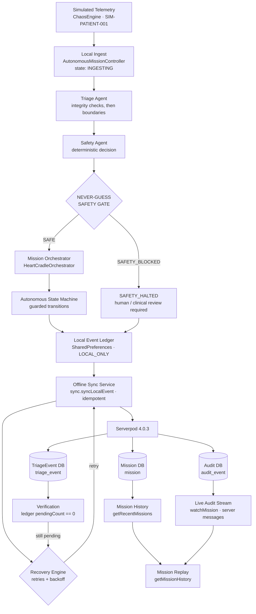

# HeartCradle AI

[](https://github.com/khanadil84/HeartCradle-AI/actions/workflows/analyze.yml)
[](https://github.com/khanadil84/HeartCradle-AI/actions/workflows/format.yml)
[](https://github.com/khanadil84/HeartCradle-AI/actions/workflows/tests.yml)


**An offline-first, autonomous clinical-operations simulation platform — telemetry in, audited mission out, and a deterministic safety gate that never guesses.**

> **Simulation only.** All telemetry in this project is *simulated*. HeartCradle AI does not diagnose, treat, monitor, or validate anything. Every automated path is gated by a deterministic safety check and routes to human/clinical review whenever the data is unsafe, incomplete, conflicting, unreliable, or missing.

---

## Table of contents

1. [Why HeartCradle AI exists](#why-heartcradle-ai-exists)
2. [The problem](#the-problem)
3. [The solution](#the-solution)
4. [The "Never Guess" Safety Gate](#the-never-guess-safety-gate)
5. [Autonomous workflow](#autonomy-autonomous-software-workflow-execution)
6. [Architecture](#architecture)
7. [Multi-agent architecture](#multi-agent-architecture)
8. [Offline-first architecture](#offline-first-architecture)
9. [Serverpod architecture](#serverpod-architecture)
10. [Recovery and resilience](#recovery-and-resilience)
11. [Chaos testing scenarios](#chaos-testing-scenarios)
12. [Mission history and replay](#mission-history-and-replay)
13. [Demo scenarios](#demo-scenarios)
14. [Tech stack](#tech-stack)
15. [Project structure](#project-structure)
16. [How to run locally](#how-to-run-locally)
17. [How to start Serverpod](#how-to-start-serverpod)
18. [How to run Flutter](#how-to-run-flutter)
19. [Example demo flow](#example-demo-flow)
20. [Safety and simulation disclaimer](#safety-and-simulation-disclaimer)
21. [Hackathon judging highlights](#hackathon-judging-highlights)
22. [Future roadmap](#future-roadmap)
23. [License](#license)

---

## Why HeartCradle AI exists

Operational software that acts on live data — flight systems, industrial control, clinical operations tooling — fails in a very specific and very expensive way: **it keeps going when it should stop.**

A pipeline that silently interpolates a missing reading, averages away a contradiction, or retries a failed write until something "looks green" is not autonomous. It is guessing with a state machine attached.

HeartCradle AI exists to demonstrate the opposite pattern as a complete, working, full-stack application:

- Autonomy is **software workflow execution**, not decision authority.
- Uncertainty produces a **hard stop**, not a plausible-sounding output.
- Everything the system did is **persisted, streamed, and replayable**.

## The problem

Building an autonomous operations pipeline that is *actually* trustworthy requires more than an LLM call or a happy-path demo:

| Problem | What it looks like in practice |
| --- | --- |
| **Garbage-in autonomy** | The pipeline continues on incomplete, conflicting, or unreliable input and produces a confident, wrong result. |
| **Offline collapse** | Connectivity is treated as a precondition. No network means no work, lost events, or duplicated writes. |
| **Unreviewable behavior** | When something goes wrong there is no record of which state the system was in, what it decided, or why. |
| **No failure drill** | Outages, retries, and partial syncs are never exercised, so they are discovered in production. |
| **Backend as an afterthought** | The client "calls an API" but persistence, typing, and streaming are ad hoc rather than part of a real protocol. |

## The solution

HeartCradle AI is a **real full-stack application**: a Flutter operations console in front of a Serverpod 4.0.3 backend, with an autonomous software workflow running end to end on simulated patient telemetry.

```
Telemetry → Local ingest → Multi-agent triage → Deterministic safety gate
  → Mission orchestration → Local persistence → Serverpod synchronization
  → Recovery → Verification → Audit / replay
```

The Flutter client owns the workflow: it runs the triage and safety agents, drives a guarded state machine, appends every event to an on-device ledger, synchronizes to Serverpod with idempotent endpoints, recovers from sync failures, verifies that the ledger drained, and emits a per-transition audit trail that the server persists and streams back live.

The Serverpod backend is **not optional plumbing** — it is where missions, triage events, and audit events live, where the generated typed protocol comes from, and where the live audit stream originates.

## The "Never Guess" Safety Gate

**This is the core idea of the project.**

When telemetry is unsafe, incomplete, conflicting, unreliable, or missing, the system must not continue and must not invent an answer. It emits:

```
SAFETY_BLOCKED
```

…and routes the workflow toward human/clinical review.

The gate is **deterministic** — same input, same decision, no model in the loop, no probabilistic tolerance:

| Checked in `TriageAgent` (data integrity first) | Signal | Gate result |
| --- | --- | --- |
| `signalQuality == 'conflicting'` | `CONFLICTING_TELEMETRY` | `SAFETY_BLOCKED` |
| `signalQuality` not `'good'` (e.g. `poor`, `missing`) | `SIGNAL_QUALITY_UNRELIABLE` | `SAFETY_BLOCKED` |
| `spo2 < 90` (good signal only) | `LOW_SPO2` | `SAFETY_BLOCKED` |
| `heartRate > 140` or `< 40` | `HEART_RATE_BOUNDARY` | `SAFETY_BLOCKED` |
| `respiratoryRate > 30` or `< 8` | `RESPIRATORY_RATE_BOUNDARY` | `SAFETY_BLOCKED` |
| `temperature > 40` or `< 35` | `TEMPERATURE_BOUNDARY` | `SAFETY_BLOCKED` |
| **Any unrecognized signal** | — | `SAFETY_BLOCKED` (default branch) |
| No signals at all | — | `SAFE` |

Two properties matter more than the thresholds themselves:

1. **Integrity before physiology.** Data-quality checks run first, so missing or contradictory readings are never reinterpreted as plausible patient values.
2. **Fail closed by default.** `SafetyAgent.evaluate` blocks on anything it does not recognize — the safe path is opt-in, not the fallback.

The same gate is implemented server-side in `TriageEndpoint.analyzeTelemetry` (`heartcradle_ai_server/lib/src/telemetry/triage_endpoint.dart`), so the backend independently refuses to persist an automated "SAFE" verdict on uncertain input.

A blocked mission is not a dead mission: the decision is still written to the local ledger, synchronized, and audited — because a refusal you cannot review is not a safety property.

## Autonomy: autonomous *software* workflow execution

"Autonomous" here means the **software advances its own workflow**, not that it makes clinical decisions. Concretely:

- **State-machine orchestration** — `AutonomousStateMachine` exposes 13 states and an explicit allow-list of transitions. Illegal transitions are rejected (`transition()` returns `false`), so the workflow cannot skip the gate or jump to `COMPLETED`.
- **Automatic mission progression** — `AutonomousMissionController` advances the mission and streams every accepted transition to the audit endpoint.
- **Deterministic safety gates** — the gate is evaluated before `executing` is ever reachable.
- **Local persistence first** — every run appends to the on-device `LocalEventLedger` before any network call.
- **Synchronization** — `OfflineSyncService` drains `LOCAL_ONLY` events through the idempotent `sync.syncLocalEvent` endpoint.
- **Automatic recovery / retry** — `RecoveryEngine` retries sync with bounded attempts and backoff.
- **Verification** — after sync, the pipeline re-checks `pendingCount()`; only a drained ledger reaches `COMPLETED`.
- **Auditability** — each transition is posted to `audit.recordEvent` (best-effort, never blocking the local state machine).
- **Replayable mission history** — persisted missions plus ordered audit events are rendered back in the console.

### State machine

| From | Allowed transitions |
| --- | --- |
| `idle` | `ingesting` |
| `ingesting` | `analyzing`, `failed` |
| `analyzing` | `safetyEvaluating`, `failed` |
| `safetyEvaluating` | `safetyBlocked`, `executing`, `failed` |
| `safetyBlocked` | `safetyHalted`, `recovering` |
| `safetyHalted` | `persisting` |
| `executing` | `persisting`, `failed` |
| `persisting` | `synchronizing`, `completed` |
| `synchronizing` | `verifying`, `recovering` |
| `verifying` | `completed`, `recovering` |
| `recovering` | `synchronizing`, `persisting`, `failed` |
| `completed` | *(terminal)* |
| `failed` | `recovering` |

There is no path from `safetyEvaluating` to `safetyBlocked` bypass, and no path to `completed` that does not pass through `verifying`.

## Architecture



Every box above maps to a file in this repository — nothing in the diagram is aspirational.

## Multi-agent architecture

The decision pipeline is a small, explicit multi-agent chain orchestrated by `HeartCradleOrchestrator` (`heartcradle_ai_flutter/lib/agents/orchestrator.dart`):

```
HeartCradleOrchestrator.run()
  ├─ TriageAgent.assess()      → TriageAssessment { severity, signals[], recommendation }
  ├─ SafetyAgent.evaluate()    → SafetyDecision   { decision, reason }
  └─ executionTrace[]          → ORCHESTRATOR_STARTED → TRIAGE_AGENT_COMPLETED
                                 → SAFETY_AGENT_COMPLETED → SAFETY_GATE_PASSED
                                 | SAFETY_BLOCKED → HUMAN_REVIEW_REQUIRED
                                 → ORCHESTRATOR_DECISION_READY
```

- **Triage Agent** (`agents/triage_agent.dart`) — classifies telemetry into signal codes. Integrity signals (`CONFLICTING_TELEMETRY`, `SIGNAL_QUALITY_UNRELIABLE`) take priority over physiological boundaries; severity is `NORMAL` or `HIGH_ATTENTION`.
- **Safety Agent** (`agents/safety_agent.dart`) — the gate. Maps signals to `SAFE` or `SAFETY_BLOCKED` with a human-readable reason, blocking on any unknown signal.
- **Orchestrator** — sequences the agents and produces the execution trace that the console renders as the `AUTONOMOUS EXECUTION TRACE` panel.

Agents are plain Dart classes with injected dependencies — trivially unit-testable, no framework, no hidden network calls.

## Offline-first architecture

Offline is the normal operating mode, not an error mode.

1. **Ingest and decide locally.** Triage, safety, orchestration, and the state machine run entirely on-device.
2. **Append to the local ledger.** `LocalEventLedger` (`lib/local_event_ledger.dart`) writes each event to `SharedPreferences` with `syncState: LOCAL_ONLY`.
3. **Sync opportunistically.** `OfflineSyncService` (`lib/services/offline_sync_service.dart`) pushes pending events through `client.sync.syncLocalEvent` and marks them `SYNCED` only after the server confirms.
4. **Server deduplicates.** `SyncEndpoint.syncLocalEvent` looks up `eventId` first and returns the existing row — retries can never create duplicates.
5. **Failures are data, not exceptions.** If Serverpod is unreachable, the result is `SyncStatus.failed`, events stay `LOCAL_ONLY`, and the recovery path takes over. Nothing is lost.
6. **Verify, then claim success.** The mission only reaches `COMPLETED` when `pendingCount() == 0`.

The console surfaces this continuously: `SYNCED` / `PENDING` / `LOCAL` counters, per-event `SYNCED` vs `LOCAL_ONLY` badges in the `EVENT TIMELINE`, and the `SERVERPOD CORE` status card.

## Serverpod architecture

Serverpod is the backbone of this submission, in four concrete ways:

### 1. Generated protocol and typed client

- Models are declared as Serverpod model files: `mission.spy.yaml`, `audit_event.spy.yaml`, `triage_event.spy.yaml`, `greeting.spy.yaml`.
- `serverpod generate` produces the server protocol (`heartcradle_ai_server/lib/src/generated/`) and the full client package (`heartcradle_ai_client/lib/src/protocol/`).
- The Flutter app talks to the backend through that generated client (`heartcradle_ai_flutter/lib/client.dart`), so every endpoint call and every payload is typed end to end.

### 2. Endpoints

| Endpoint | Methods | Role |
| --- | --- | --- |
| `mission` | `startMission`, `updateMission`, `getRecentMissions`, `getMission`, `getMissionHistory` | Mission persistence, history, and per-mission audit retrieval |
| `audit` | `recordEvent`, `watchMission` | Audit persistence **and** live streaming via Serverpod server messages (`mission_audit_<missionId>`) |
| `sync` | `syncLocalEvent` | Idempotent ingestion of local ledger events into `triage_event` |
| `triage` | `analyzeTelemetry` | Server-side NEVER-GUESS gate + `TriageEvent` persistence |
| `greeting`, `emailIdp`, `jwtRefresh` | — | Serverpod example endpoint and auth services initialized in `lib/server.dart` |

### 3. Databases and migrations

- **Mission table** (`mission`) — mission id, patient id, status, step counters, start/finish timestamps, last event.
- **Audit table** (`audit_event`) — unique `eventId`, `missionId`, event name, `fromState` → `toState`, timestamp.
- **TriageEvent table** (`triage_event`) — the synchronized telemetry snapshot plus the decision and reason.

Five generated migrations are checked in under `heartcradle_ai_server/migrations/` (tracked in `migration_registry.txt`), and `serverpod start` applies pending migrations on boot. New databases are built from `definition.sql`.

### 4. Live audit stream and sync

- `AuditEndpoint.recordEvent` inserts the event **and** posts it to the `mission_audit_<missionId>` message channel; `watchMission` exposes it as a `Stream<AuditEvent>`.
- The console subscribes through `MissionAuditStreamService` (`lib/services/mission_audit_stream_service.dart`) as soon as a mission is created, so the `CURRENT` step in the `AUTONOMOUS MISSION` panel updates in real time while the mission runs.
- `lib/server.dart` wires up Serverpod auth services (JWT + email identity provider), static/cached web routes, the `/assets/assets/config.json` API config route for the Flutter client, Flutter web serving, and database-backed cloud storage.

## Recovery and resilience

| Component | File | Behavior |
| --- | --- | --- |
| `RecoveryEngine` | `lib/autonomy/recovery_engine.dart` | Up to **3 attempts**, **2s** delay between attempts; returns `recovered`, `attempts`, final `SyncResult`, message |
| `OfflineSyncService` | `lib/services/offline_sync_service.dart` | Drains `LOCAL_ONLY` events one by one; stops on first failure so partial progress is preserved and reported |
| `AutonomousPipeline` | `lib/autonomy/autonomous_pipeline.dart` | On `sync != synced` → `recovering` → retry → `synchronizing` → `verifying` → `completed`, or `failed` with `RECOVERY_EXHAUSTED` |
| Audit path | `lib/autonomy/mission_controller.dart` | `client.audit.recordEvent` is wrapped in `try/catch`: the **local transition stays authoritative**, and audit persistence can catch up later without blocking a mission |

Recovery outcomes are surfaced in the `RECOVERY STATUS` panel as `NOT REQUIRED`, `RECOVERED`, or `FAILED`, with attempt count and message.

## Chaos testing scenarios

`ChaosEngine` (`lib/autonomy/chaos_engine.dart`) generates fixed, reproducible telemetry sets for each scenario — no randomness, so a demo always replays the same way:

| Scenario | HR | SpO₂ | RR | Temp | Signal quality | Expected outcome |
| --- | --- | --- | --- | --- | --- | --- |
| `normal` | 82 | 98 | 16 | 36.8 | `good` | `SAFE` → mission completes |
| `unreliableSignal` | 142 | 84 | 31 | 39.2 | `poor` | `SAFETY_BLOCKED` (signal first) |
| `lowSpo2` | 118 | 84 | 24 | 37.1 | `good` | `SAFETY_BLOCKED` (`LOW_SPO2`) |
| `conflictingTelemetry` | 142 | 98 | 8 | 36.8 | `conflicting` | `SAFETY_BLOCKED` (`CONFLICTING_TELEMETRY`) |
| `missingSensor` | 0 | 0 | 0 | 0.0 | `missing` | `SAFETY_BLOCKED` (no fabricated values) |
| `serverpodUnavailable` | 82 | 98 | 16 | 36.8 | `good` | Sync failure injected → recovery → verify |

The `serverpodUnavailable` scenario additionally sets `simulateSyncFailure` in `AutonomousPipeline.run`, which forces the first sync result to `failed` and exercises the real recovery path.

## Mission history and replay

- `mission.startMission` persists a `Mission` row (`HC-<microseconds>` mission id, `SIM-PATIENT-001`, `totalSteps = 9`) before the workflow runs.
- Every accepted state transition is posted to `audit.recordEvent` with a unique `eventId` (`<missionId>-<timestamp>`), `fromState`, and `toState`.
- The **MISSION HISTORY / REPLAY** panel loads `getRecentMissions(limit: 20)`; pressing **REPLAY** on a mission fetches `getMissionHistory(missionId)` and renders the ordered audit events — the exact execution trace, reconstructed from the database.
- Because audit writes are idempotent by `eventId` and local state is authoritative, replay reflects what actually happened, including blocked and recovered missions.

## Demo scenarios

Run these from the operations console (select the scenario in **CHAOS SIMULATION**, then press **RUN SAFETY-GATED TRIAGE**):

1. **NORMAL** — safe telemetry → full automated workflow → mission reaches `COMPLETED`, ledger event written, event synchronized, `SYNC_VERIFIED`.
2. **LOW SPO2** — SpO₂ 84% on a good signal → triage flags `LOW_SPO2` → **`SAFETY_BLOCKED`** → automation path shows `SAFETY HALTED`, status `HUMAN REVIEW REQUIRED`; the decision is still persisted, synced, and audited.
3. **CONFLICTING TELEMETRY** — internally contradictory sensor quality → `CONFLICTING_TELEMETRY` → **`SAFETY_BLOCKED`**.
4. **MISSING SENSOR** — all-zero readings with `missing` signal quality → `SIGNAL_QUALITY_UNRELIABLE` → **`SAFETY_BLOCKED`** (zeros are never interpreted as real values).
5. **UNRELIABLE SIGNAL** — `poor` signal quality → **`SAFETY_BLOCKED`**, even though numeric values are also out of bounds; integrity wins over physiology.
6. **SERVERPOD UNAVAILABLE** — sync failure injected → `recovering` → `RecoveryEngine` retries → retry succeeds → `SYNC_COMPLETED_AFTER_RECOVERY` → verification → `COMPLETED`, with attempts and message in **RECOVERY STATUS**. (With the backend actually stopped, retries exhaust, the mission ends `FAILED`, and events remain safely `LOCAL_ONLY` for the next sync.)
7. **MISSION HISTORY / REPLAY** — select any persisted mission → **REPLAY** → ordered audit events (`EVENT | FROM_STATE -> TO_STATE`) render as the execution trace; the live stream (`watchMission`) updates the current step while a mission is running.

## Tech stack

| Layer | Technology |
| --- | --- |
| Mobile / desktop / web client | Flutter 3.44.4, Dart SDK `^3.12.2`, Material 3 dark theme |
| Backend | Serverpod 4.0.3 (`serverpod`, `serverpod_auth_idp_server`, `serverpod_cloud_storage`) |
| Client SDK | `serverpod_client`, `serverpod_auth_idp_flutter`, generated `heartcradle_ai_client` package |
| Database | PostgreSQL 16 — embedded instance managed by Serverpod (`database.dataPath`), `docker-compose.yaml` provided as an alternative |
| Local storage | `shared_preferences` (`LocalEventLedger`) |
| Transport | Serverpod generated protocol over HTTP; server messages for the audit stream |
| Tooling | Serverpod CLI, `serverpod generate`, `serverpod create-migration`, `flutter_driver` |
| CI | GitHub Actions: `analyze.yml` (`dart analyze --fatal-infos`), `format.yml` (`dart format --set-exit-if-changed`), `tests.yml` (`dart test` against an embedded test database — no Docker) |

## Project structure

```
heartcradle_ai/
├── pubspec.yaml                     # Dart workspace: client + server + flutter
├── AGENTS.md                        # Contributor / agent conventions
├── .github/workflows/               # analyze, format, tests
│
├── heartcradle_ai_flutter/          # Flutter operations console
│   └── lib/
│       ├── main.dart                # App entry, runs the pipeline for a scenario
│       ├── dashboard.dart           # Emergency Operations Console (panels, replay, stream)
│       ├── client.dart              # Generated Serverpod client wiring + server URL
│       ├── local_event_ledger.dart  # On-device event ledger (LOCAL_ONLY → SYNCED)
│       ├── agents/
│       │   ├── triage_agent.dart    # Signal classification
│       │   ├── safety_agent.dart    # NEVER-GUESS safety gate
│       │   └── orchestrator.dart    # Multi-agent chain + execution trace
│       ├── autonomy/
│       │   ├── autonomous_pipeline.dart      # End-to-end mission run
│       │   ├── autonomous_state_machine.dart # Guarded 13-state machine
│       │   ├── mission_controller.dart       # Transitions + audit emission
│       │   ├── autonomous_mission.dart       # Mission snapshot / status
│       │   ├── chaos_engine.dart             # Reproducible scenario telemetry
│       │   └── recovery_engine.dart          # Bounded retry with backoff
│       └── services/
│           ├── offline_sync_service.dart     # Ledger → Serverpod sync
│           └── mission_audit_stream_service.dart  # Live audit stream
│
├── heartcradle_ai_server/           # Serverpod backend
│   ├── lib/
│   │   ├── server.dart              # Auth services, routes, cloud storage, web app
│   │   └── src/
│   │       ├── mission/mission_endpoint.dart   # Mission persistence + history
│   │       ├── audit/audit_endpoint.dart       # Audit persistence + streaming
│   │       ├── sync/sync_endpoint.dart         # Idempotent event ingestion
│   │       ├── telemetry/triage_endpoint.dart  # Server-side safety gate
│   │       ├── greetings/ auth/ web/           # Example + auth + web routes
│   │       └── generated/                      # DO NOT EDIT — generated protocol
│   ├── migrations/                  # Generated schema migrations
│   ├── config/                      # development / test / staging / production
│   └── test/integration/            # withServerpod endpoint tests
│
└── heartcradle_ai_client/           # Generated Serverpod client package
    └── lib/src/protocol/            # Mission, AuditEvent, TriageEvent, endpoints
```

## How to run locally

**Prerequisites**

- Dart SDK `^3.12.2` and Flutter `^3.44.4`
- Serverpod CLI 4.0.3: `dart install serverpod_cli@4.0.3`
- PostgreSQL: **not required for local dev or tests** — `config/development.yaml` sets `database.dataPath`, so Serverpod starts and manages an embedded development database. `heartcradle_ai_server/docker-compose.yaml` is included as an optional container-based alternative.

**Steps**

```bash
git clone https://github.com/khanadil84/HeartCradle-AI.git
cd HeartCradle-AI

flutter pub get            # resolves the workspace (client + server + flutter)

cd heartcradle_ai_server
serverpod start            # starts the backend + applies migrations + launches the app
```

Press `Q` in the `serverpod start` console to shut everything down.

**Checks**

```bash
cd heartcradle_ai_server && dart analyze && dart format --set-exit-if-changed . && dart test
cd heartcradle_ai_flutter && flutter analyze && flutter test
```

## How to start Serverpod

```bash
cd heartcradle_ai_server
serverpod start
```

What this gives you:

| Service | Port |
| --- | --- |
| API server | `http://localhost:8080` |
| Insights server | `http://localhost:8081` |
| Web server | `http://localhost:8082` |

- Pending migrations from `migrations/` are applied automatically at boot.
- The companion Flutter app declared under `serverpod: flutter_apps:` in `heartcradle_ai_server/pubspec.yaml` is launched automatically (`auto_launch: true`, target `lib/driver.dart`).
- File watching re-runs incremental code generation and hot-reloads both server and app; use a hot restart after changes that hot reload cannot handle.

There is an equivalent VS Code task, `serverpod_start`, in `.vscode/tasks.json`.

Other useful commands (only when needed):

```bash
cd heartcradle_ai_server
serverpod generate                      # regenerate protocol / client after model or endpoint changes
serverpod create-migration             # write a new migration after editing a .spy.yaml model
```

## How to run Flutter

```bash
cd heartcradle_ai_flutter
flutter run
```

Notes:

- The Serverpod backend must be running first — the console reads its API URL from `assets/config.json`, which the server serves at `/assets/assets/config.json`; it defaults to `http://localhost:8080`.
- On a physical device, point the client at your machine: `flutter run --dart-define=SERVER_URL=http://<your-ip>:8080/`.
- `serverpod start` also launches the app for you (target `lib/driver.dart`, which enables the Flutter driver extension with text-entry emulation off so the app stays usable by hand).
- Recommended targets: Chrome or a native desktop/mobile target.

## Example demo flow

1. Start the backend: `cd heartcradle_ai_server && serverpod start`.
2. In the **Emergency Operations Console**, set the scenario dropdown to **LOW SPO2**.
3. Press **RUN SAFETY-GATED TRIAGE**.
4. Watch the panels in order:
   - **AUTONOMOUS MISSION** — step counter advances through `INGESTING → ANALYZING → SAFETY_EVALUATING → SAFETY_BLOCKED → SAFETY_HALTED → PERSISTING → SYNCHRONIZING → VERIFYING`, with the `CURRENT` step updated live from the audit stream.
   - **NEVER-GUESS SAFETY GATE** — red `SAFETY_BLOCKED` with the reason *"Low SpO2 detected. Human clinical review required."* and status `HUMAN REVIEW REQUIRED`.
   - **AUTONOMOUS EXECUTION TRACE** — final state, automation path (`SAFETY HALTED`), sync status, and the trace lines.
   - **EVENT TIMELINE** — the new `TRIAGE_ANALYSIS` event, `LOCAL_ONLY` until sync confirms, then `SYNCED`.
   - **MISSION HISTORY / REPLAY** — press **REPLAY** on the mission to read back the ordered audit trail.
5. Switch the scenario to **SERVERPOD UNAVAILABLE** to watch **RECOVERY STATUS** move from `STANDBY` to `RECOVERED` with the attempt count.

## Safety and simulation disclaimer

> **HeartCradle AI is a simulation and software-operations demonstration.**
>
> - All patient telemetry is **simulated** (patient id `SIM-PATIENT-001`); there are no sensors, no devices, and no real patient data.
> - The system performs **no medical diagnosis, no treatment recommendation, and no real-world patient monitoring.**
> - No claim of clinical validation, medical-device certification, regulatory compliance, or patient outcome is made or implied.
> - Any action with clinical meaning is **safety-gated** and **requires human review**; `SAFETY_BLOCKED` is the designed outcome for unsafe, incomplete, conflicting, unreliable, or missing input.
> - Thresholds and signals are configuration for demonstrating deterministic gating logic, not clinical guidance.

## Hackathon judging highlights

- **A real full-stack application**, not a mock: Flutter client → generated Serverpod protocol → PostgreSQL, with CI running analyze, format, and tests on every push.
- **Serverpod is deeply integrated** — generated client and protocol, five database migrations, mission/audit/triage persistence, endpoint surface, server-message streaming, auth services, and a live audit stream the UI subscribes to.
- **Offline-first by construction** — decisions are made and persisted locally first; the network only ever *confirms* work already recorded.
- **Autonomous software orchestration** — a guarded 13-state machine with an explicit transition allow-list, automatic mission progression, bounded recovery, and post-sync verification.
- **Deterministic safety gates** — a fail-closed, human-readable NEVER-GUESS gate implemented identically on client and server.
- **Multi-agent decision pipeline** — triage agent → safety agent → orchestrator, each an injectable, testable Dart class producing a structured execution trace.
- **Chaos and recovery testing built into the product** — six reproducible scenarios, including a controlled synchronization outage exercised through the recovery engine.
- **Persistent mission and audit trail** — `mission` and `audit_event` tables with idempotent writes keyed by `eventId`.
- **Real-time audit stream** — `watchMission` pushes each transition to the console while the mission runs.
- **Replayable missions** — persisted history rendered back as an ordered execution trace.
- **A polished operations console** — scenario control, telemetry tiles, mission progress, gate verdict, execution trace, recovery status, history/replay, and event timeline in one dark, dense UI.

## Future roadmap

Candidate directions after the hackathon — none are implemented today:

- Role-based reviewer sign-off flow for `SAFETY_BLOCKED` missions (closing the human-review loop in-app).
- Configurable safety-boundary profiles per scenario instead of constants in `TriageAgent`.
- Server-driven mission state updates via the existing `mission.updateMission` endpoint.
- Streaming ledger backfill so recovery can drain a large offline queue with pacing and progress UI.
- Additional chaos scenarios (partial sync, corrupt local event, audit-endpoint outage).

## License

No open-source license has been declared for this repository yet. Until a `LICENSE` file is added, all rights are reserved by the author. This project is submitted as an entry to the Serverpod Hackathon; judges and evaluators are welcome to inspect and run the code in that context. If you want to reuse any part of it, open an issue or contact the author first.
